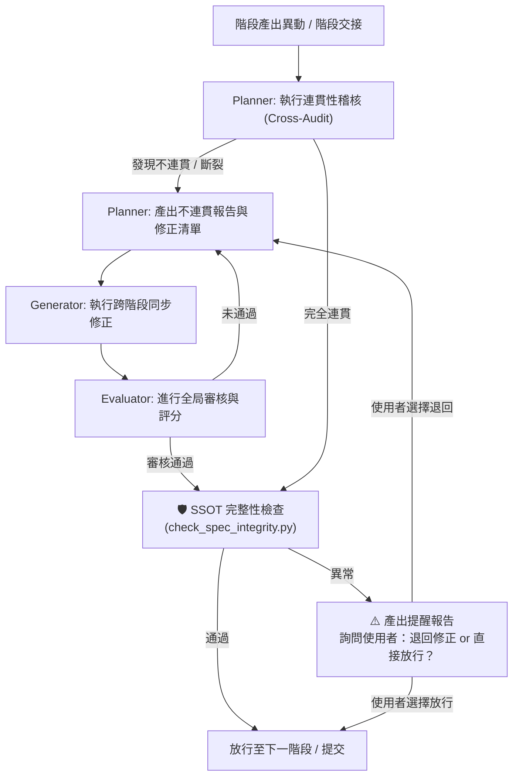

# 專案開發規則與防線規範 (AGENTS.md)

👉 **最高指導框架原則**：本專案在自動化開發與 Harness 駕馭工程中的最高原則規範，已統一收錄於 docs 目錄下的 [CORE_RULES.md](../docs/CORE_RULES.md)。本文件（AGENTS.md）內的所有子規章與實作內容，皆基於此指導守則進行發展，且絕不得與其衝突。

本文件定義了本專案在 SSDLC 開發生命週期中，各 AI 代理（Planner、Generator、Evaluator）必須嚴格遵守的全局行為準則，特別是「全局連貫性檢核與修正大工程」、「版本管控與組態管理」、「活系統規格書同步」以及「Windows Server + IIS 部署環境適配」的執行規範，以防止規格脫節與需求追溯遺漏。


---

## 一、 全局連貫性工程 (Global Alignment Engineering) 規範

本系統採用「外層全域 Agent + 內層階段性局部駕馭工程 PDCA 迴圈」之雙層解耦架構。系統在每個 SSDLC 階段的產出物提交前，必須觸發「全局連貫性大循環」進行交叉驗證與修正：



### 1. 外層：全域主控 Global Agent（唯一頂層）
*   **全域掌控與追溯**：負責 SSDLC 六階段的全域掌控、需求追溯、版本同步與 IIS 站台規格同步。
*   **階段切換與 Baseline 鎖定**：每階段驗證穩定後，封存其穩定可執行的 Baseline。前一階段產生 Baseline，方可切換權限進入下一階段。

    **🛡️ 階段完成後自動 SSOT 完整性提醒**：
    1.  **Evaluator 通過後**：AI 代理自動執行 `python scripts/check_spec_integrity.py --project <專案目錄> --mode B`（階段產出一致性檢查）。若在專案目錄內執行，可省略 `--project` 參數由腳本自動偵測。
    2.  **進入下一階段前**：AI 代理自動執行 `python scripts/check_spec_integrity.py --project <專案目錄> --mode C`（追溯鏈完整性檢查）。
    3.  **若檢查發現異常**：⚠️ AI 代理產出提醒報告（列出缺失/不一致項目），並**詢問使用者**：「是否退回上階段修正，或直接放行進入下一階段？」
        - 使用者選擇**退回修正** → 退回 Planner，修正後重新提交 Evaluator。
        - 使用者選擇**直接放行** → 放行進入下一階段，異常項目記錄於 `phase_gates.json` 供後續追蹤。
    4.  **檢查通過後**：寫入 `phase_gates.json` 紀錄（`ssot_integrity_checked: true`）。
    5.  **自動建立 Baseline**：Evaluator 通過且 SSOT 檢查（`check_spec_integrity.py --mode B`）全部通過後，AI 代理自動執行 `@baseline` 指令，建立本階段穩定快照至 `baseline/phase-{NN}/baseline-v{N}/`。
        *   若 `baseline/` 目錄不存在，自動建立。
        *   版本號自動遞增（v1 → v2 → ...）。
        *   保留最近 3 份 Baseline，舊版自動清理。
        *   建立完成後自動執行基線可執行性驗證（參考 `commands_reference.md` 第二章第 5 節）。

### 2. 內層：安全軟體開發生命週期六階段（通稱 SSDLC）局部 PDCA（各階段獨立運作）
*   軟體開發生命週期切割為 SSDLC 六階段，每一階段獨立執行一套 Plan -> Generator -> Evaluator 的 PDCA 閉環。
*   **Plan 階段 (PDCA-P)**：承接上階段交付物與 Baseline，定義目標與交付物，執行 Skill 複選，並進行 Windows/IIS 環境靜態黑白名單衝突檢核。如果選取了互斥 Skill，直接判定為 B 類根源錯誤，不進入執行以節省 Token。
*   **Generator 階段 (PDCA-D)**：作為唯一執行層，遵循「只執行、不自行擴大修改範圍」之鐵律。執行完成後自動儲存 Windows 本地絕對路徑快照至各該階段的 `snapshots/` 目錄，回溯時直接載入快照以降低 Token 消耗。
*   **Evaluator 階段 (PDCA-C & PDCA-A)**：負責成果規格檢核與 Windows/IIS 流程軌跡完整性檢核。補充 IIS 站台日誌、進程日誌與 Windows 事件日誌雙軌驗證機制。

---

## 二、 系統規格書同步與 SSOT 銜接規範

### 2.1 活系統規格書 (Living Specification)

為了將系統需求與自動化測試完美結合，專案使用 system_specification.md 作為活文件：

1.  **規格即測試**：此文件必須包含 Gherkin 語法（Given/When/Then）的場景區塊。
2.  **狀態回寫**：每次執行測試治具（Harness）後，治具程式必須自動解析測試結果，將各功能模組的測試狀態寫回 system_specification.md。
3.  **上線防線**：Evaluator 將會拒絕合併任何在 system_specification.md 中仍包含未通過狀態之 Scenario 的 PR。

### 2.2 SSOT 三軌規格架構

| 軌道 | 檔案 | 格式 | 讀者 |
|:---|:---|:---|:---|
| 結構化可執行規格 | specs/executable_spec.yaml | YAML | AI |
| 行為化可執行規格 | specs/features/requirements.feature | Gherkin | AI |
| 人可讀系統規格書 | system_specification.md | Markdown | 人類 |

### 2.3 階段銜接機制 (spec_ref.md)

每個階段的 inputs/ 目錄必須包含 spec_ref.md，記錄本階段必讀的 SSOT 規格路徑。
AI 代理執行前必須先讀取 spec_ref.md 中列出的所有規格，未讀取即執行者，Evaluator 判定為 B 類錯誤。

### 2.2.5 每階段完成後自動同步 SSOT 規則（活系統規格書）

> `system_specification.md` 為活文件（Living Specification），每個 SSDLC 階段 Evaluator 通過後，AI 代理必須將該階段的關鍵產出摘要自動同步回寫，確保規格書隨開發進度持續生長，而非停留在 Phase 01。

**同步時機**：各階段 Evaluator 通過後，AI 代理自動執行。

| 階段 | 同步內容 | 寫入目標 |
|:---|:---|:---|
| **Phase 01** | FR/NFR 清單 → YAML；Acceptance Criteria → Gherkin | `executable_spec.yaml` + `requirements.feature` |
| **Phase 02** | DB Schema 摘要（資料表清單 + 關聯）、API 端點清單、架構圖參照 | `system_specification.md` |
| **Phase 03** | 技術棧（語言/框架/資料庫）、模組結構、關鍵實作決策 | `system_specification.md` |
| **Phase 04** | 測試覆蓋摘要（覆蓋率/通過率）、已知限制與技術債 | `system_specification.md` |
| **Phase 05** | 部署架構（環境/容器/CI/CD）、環境參數（URL/Port/憑證） | `system_specification.md` |
| **Phase 06** | 維護記錄摘要（Hotfix 歷程、變更原因）、回歸測試結果、營運監控指標（CPU/記憶體/回應時間/錯誤率）、維運 SLA | `system_specification.md` |

**AI 代理執行規範**：
1.  Evaluator 通過後，檢查當前期段對應的同步內容是否已寫入目標檔案。
2.  若尚未寫入，自動從該階段 `outputs/` 目錄萃取摘要內容，以 Markdown 格式 append 至 `system_specification.md` 的對應章節。
3.  同步完成後更新 `system_specification.md` 的 `last_updated` 時間戳。
4.  此為強制步驟。未執行者，Evaluator 於下一階段 Checkpoint C 偵測到規格落後時，判定為 B 類錯誤。

**Phase 04 測試報告自動同步（強制）**：每次 pytest 或 Playwright 執行完成後，AI 代理必須自動解析測試輸出，將通過/失敗/跳過統計、覆蓋率與執行日期更新至該專案 outputs/test_results.md。若報告日期早於測試腳本最後修改日期，Evaluator 應判定為報告過期（B 類錯誤），要求重新執行測試後再放行。

### 2.3.5 專案規格 ↔ 框架模板同步規則

> 根層級 `specs/executable_spec.yaml` 為 `@init` 建立新專案時複製用的**空白模板**。專案層級（如 `demo_project/specs/executable_spec.yaml`）為該專案的**實際 SSOT**。兩者須保持結構同步。

*   **同步觸發時機**：當專案層級 `executable_spec.yaml` 發生以下結構性變更時，必須同步回根層級模板：
    1.  `requirements` 結構新增/調整（如新增需求欄位、變更需求分類）。
    2.  `phases` 階段的 `outputs` 定義變更（新增/移除標準產出）。
    3.  `security_controls` 安全控制項結構調整。
    4.  YAML schema 版本號變更。
*   **不需同步的情況**：僅變更需求內容（如需求描述、數量），未動到 YAML 結構定義。
*   **AI 代理執行規範**：上述觸發條件發生時，於 Evaluator 通過後自動比對專案層級與根層級模板的 YAML 結構，若結構不一致則提示使用者是否同步。使用者確認後，將專案層級的結構更新至根層級模板（保留模板佔位值）。
*   **雙向追溯**：變更記錄寫入 `memory.md`，標註 `[TEMPLATE_SYNC]` 標籤。

### 2.4 SSOT 完整性監控機制（🛡️ 自動提醒 + 使用者決策）

> ℹ️ **以下 4 個檢查點 AI 代理會自動執行。** 若檢查發現異常，AI 代理會產出提醒報告，並**詢問使用者**要「退回修正」還是「直接放行」。此為「提醒 + 互動決策」機制，由使用者做最終決定。

為確保規格在開發過程中不被遺漏、移動或損毀，AI 代理會在以下檢查點自動執行規格完整性驗證並回報結果：

#### 檢查點 A：階段啟動時（Planner 執行前）
- 檢查 inputs/spec_ref.md 指向的所有規格檔案是否存在
- 檢查 executable_spec.yaml 是否為有效 YAML
- 檢查 requirements.feature 場景數是否與 executable_spec.yaml 中需求數一致
- 若任一檢查失敗 → 暫停執行，輸出缺失清單

#### 檢查點 B：階段完成時（Evaluator 執行後）
- 檢查本階段產出是否與 SSOT 定義的需求/API/資料模型一致
- 檢查所有 Mermaid 圖表語法（三個 backtick 配對正確）
- 檢查階段產出檔案清單是否與 executable_spec.yaml 中 phases.[階段].outputs 一致
- 若發現不一致 → B 類錯誤

- **🔄 報告過期檢查**：檢查 outputs/ 目錄下 	est_results.md 與 security_check_report_*.md 的修改日期，若早於 inputs/ 目錄下任何原始碼檔案的最後修改日期，判定為報告過期（B 類錯誤），要求重新執行對應測試或安全檢核後再放行。
#### 檢查點 C：跨階段交接時
- 檢查下一階段 inputs/ 是否包含 spec_ref.md
- 檢查 traceability_matrix.md 追溯鏈是否完整
- 若追溯鏈斷裂 → 原則禁止進入下一階段；如需放行，必須使用 `@unlock` 並記錄原因。

#### 檢查點 D：Git 提交前（Pre-commit Hook）
- 執行規格完整性掃描腳本：python scripts/check_spec_integrity.py
- 檢查 executable_spec.yaml vs 實際目錄結構是否一致
- 產出 integrity_report.md 於 logs/ 目錄
- 若檢查失敗 → 拒絕提交


---

## 三、 版本管控與組態管理 (Configuration Management) 規範

為了確保系統型態的完整度，防止任何未經授權的修改或版本防線漂移：

### 1. 全產物 Git 版本管理與 Windows 快照機制
*   **分支規定**：所有開發工作必須在非 `main` 分支上進行。禁止直接推送至 `main`。
*   **本地快照管理**：全面停用 Docker 容器機制。各階段的快照與執行軌跡（包含配置參數、快照、錯誤日誌與版本差異等）應存放在各階段的 `snapshots/` 與 `logs/` 目錄下。快照儲存與版本管控改用 Windows 本地檔案系統的時間戳快照機制（本機保留最近 5 筆快照，並自動清理舊資料防止儲存膨脹），並與本地 Git 倉庫進行比對。階段結束後必須自動向上回傳全域 Agent。
*   **提交規範**：每次提交時，必須確保當前階段的 `traceability_matrix.md` 狀態為最新，且通過自動化測試治具的驗證。

### 2. 組態基準與 Windows 權限稽核
*   **組態基線標記**：在各階段交接或發布時，必須對當前程式碼與文件建立 `git tag` 基線（格式為 `baseline-phase{NN}-vN`）。
*   **發布前雜湊比對**：比對實體產物與 `outputs/build_manifest.json` 記錄的 SHA-256 雜湊值。若不符則強制拒絕發布。
*   **Windows 與 IIS 權限管控**：適配 Windows 原生 NTFS 檔案讀寫權限與 IIS 匿名存取 (IUSR) 安全網，並於 Plan 階段前置檢核路徑編碼與檔案鎖定狀態，防止 403/404 異常。

---

## 四、 代理基本行為守則 (Harness Rules)

### 1. Planner (規劃代理)
*   **規劃優先**：任何需求變更或 Bug 修復，必須先由 Planner 更新 YAML 規格書並產出任務清單，嚴禁直接動手寫原始碼。
*   **業務邊界**：規劃時必須明確定義「系統不做什麼」，以防止 AI 生成冗餘程式碼。

### 2. Generator (執行代理)
*   **執行但不擴大範圍**：嚴格依照任務清單與 YAML 規格進行開發，禁止擅自修改系統架構。完成後可執行預定義的編譯、測試與驗證指令，但不得自行解讀結果並改變架構；驗證結果交由 Evaluator 判定。
*   **最小變更原則**：僅修改與任務相關的程式碼，禁止在未授權情況下重構無關模組。

### 3. Evaluator (審查代理)
*   **只審查，不改稿**：客觀且挑剔地逐條對照 YAML 規格與編譯品質。評分未達標者一律退回。

---

## 五、 上下文管理與防錯紀律（含 A/B 類錯誤分級重試）

1.  **強制重置上下文**：在每個模組或階段任務完成後，必須立即重置對話上下文，防止長對話累積認知幻覺。
2.  **重置後重新讀取**：重置上下文後，必須強制重新讀取本 `AGENTS.md` 規則檔案，確保 AI 隨時遵循專案紀律。
3.  **基準與安全網**：在進行任何程式碼或規格變更前，必須先建立基準 (Baseline)，若驗證失敗且無法立即修復，必須在 5 分鐘內完全還原至基準 (Baseline) 狀態。
4.  **錯誤二分類機制與分級重試**：
    *   **A 類錯誤（執行層臨時錯誤）**：
        *   包括：參數錯誤、IIS 逾時、Windows 進程中斷、權限異常、網路連線中斷、DOM 找不到元素、執行短暫衝突等。
        *   **重試規則**：允許局部重試最多 3 次。回溯點僅退回 Generator，不重跑 Plan。重試採用指數退避，新錯誤重置計數器。滿 3 次失敗則升級為 B 類錯誤處理。
    *   **B 類錯誤（規劃層根源錯誤）**：
        *   包括：Skill 互斥、需求矛盾、設計缺陷、架構問題等。
        *   **重試規則**：直接跳過局部重試，立即升級全域迭代（重跑該階段完整 PDCA）。全域自動迭代上限為 2 輪，滿 2 輪仍失敗則自動暫停、移交人工處理。
5.  **IIS 專屬部署與環境衝突檢核**：
    *   在 Plan 階段執行靜態衝突檢查。
    *   **Docker 與 IIS 互斥規則**：`Docker 部署環境` 與 `IIS 部署操作` 為互斥關係，禁止同時選用，否則直接判定為 B 類錯誤攔截，避免環境配置衝突。
    *   **IIS 專屬部署規則**：為防止 IIS 原生回收機制中斷長任務，必須設定應用程式集為進程駐留、關閉自動回收，並啟用 IIS 站台日誌與 Windows 系統事件日誌雙軌記錄，以支援問題追溯。
6.  **階段結果自動回傳與快照日誌清理**：
    *   每一輪局部 PDCA 完成後，該階段之完整檢核結果（包含 Skill 配置參數、執行快照、錯誤日誌、版本差異、人機對話紀錄與驗證報告等，存放在 `snapshots/` 與 `logs/` 目錄）必須自動上傳至全域主控 Agent。
    *   全域 Agent 接收並同步更新需求追溯鏈、規格文件、對話紀錄與新版 Baseline 穩定版本。
    *   系統必須嚴格執行物理目錄中快照最近 5 筆的保留規則，並自動清理舊資料，以防範儲存空間膨脹。

---

## 六、 引導式專案初始化與階段 Skill 配置規範 (AI 代理對話指令協議)

為極簡化專案配置流程，AI 代理在與使用者對話時，必須主動辨識並執行以下對話指令：

### 0. 指令參照查詢指令：`@help`
*   **指令定義**：立即顯示指令集參照表的完整內容，方便使用者快速查閱所有可用指令與語法。
*   **AI 代理執行規範**：
    1.  AI 代理必須讀取 [commands_reference.md](../docs/commands_reference.md) 的完整內容。
    2.  將內容以結構化方式呈現於對話中，包含所有指令的語法、參數與用途說明。

### 1\. 階段查詢指令：`@stages`
*   **指令定義**：查詢 SSDLC 各開發階段之代碼與中文名稱對照。
*   **AI 代理執行規範**：
    1.  必須立即輸出以下對照表（六大核心開發階段 + 跨階段全域共用層）：
        *   `00` : 跨階段全域共用 (cross_phase)
        *   `01` : 規劃與需求分析 (planning_and_analysis)
        *   `02` : 系統設計 (system_design)
        *   `03` : 開發與編碼 (implementation_and_coding)
        *   `04` : 測試驗證 (testing)
        *   `05` : 部署發布 (deployment)
        *   `06` : 維護與營運 (maintenance)
    2.  說明如何使用 `@[階段代碼]` 進行進一步查詢，以及使用 `@[階段代碼]/[快捷編號]` 進行導入。

### 2. 階段 Skill 查詢指令：`@[階段雙位數代碼]`
*   **指令定義**：查詢指定階段的可用 Skill 清單與用途說明（例如：`@01`）。
*   **AI 代理執行規範**：
    1.  自動掃描全域或專案 Skill 庫中，歸屬於該開發階段的所有可用 Skill。
    2.  **快捷編號分配**：AI 代理必須按字母/數字順序對掃描出的所有可用 Skill 進行排序，並為其分配雙位數快捷編號（由 `01` 開始，如 `01`, `02`, `03` ...）。
    *   **⚠️ 防呆**：嚴禁在快捷編號前加上任何字母前綴（如 S01、No.01、#01 等），僅允許純雙位數數字。若 AI 代理輸出時誤加前綴，視為格式錯誤，必須立即修正後重新輸出。
    3.  **富資訊解析**：AI 必須動態讀取這些可用 Skill 之 `SKILL.md` 檔案，解析其 YAML Frontmatter 中的 `description`（用途描述）欄位。
    4.  條列式輸出各 Skill 的「快捷編號 — 實體名稱 — 用途描述」與「導入指令範例」。
    5.  提供對應的導入指令範例，提示使用者進行導入。
    6.  **🌐 通用 Skill 一併顯示**：在列出階段專屬 Skill 後，AI 代理必須同時掃描 `skills/00_cross_phase/` 目錄，將所有通用 Skill 以 `G` 前綴快捷編號（`G01`, `G02`, `G03` ...）列於「🌐 通用 Skill（所有階段皆可選用）」區塊中，供使用者一併選用。
        ```
        📂 Phase 02 系統設計 專屬 Skill：
          01  db_schema_design       資料庫結構設計
          ...

        🌐 通用 Skill（所有階段皆可選用）：
          G01  git                   版本控制與 Baseline 管理
          G02  brainstorming         腦力激盪與創意展開
          G03  docx                  Word 文件處理
          G04  pdf                   PDF 處理與 OCR
          ...
        ```
    7.  **導入提示**：在輸出清單後，提示使用者可使用 `@02/01,G01,G03` 語法混搭階段專屬與通用 Skill。


### 3. 直接與聯合導入 Skill 指令：`@[階段雙位數代碼]/[快捷編號]` 或 `@[階段雙位數代碼]/[快捷編號_1],[快捷編號_2]`
*   **指令定義**：將指定的單個或多個 Skill（以逗號 `,` 聯合參數組合）部署至當前專案對應的階段目錄。支援 `G` 前綴混搭通用 Skill（如 `@02/01,G01,G03`），將通用 Skill 從 `skills/00_cross_phase/` 引入至指定階段，並合併規範與登錄追溯。
*   **AI 代理執行規範**：
    0.  **專案初始化防呆 (Project Init Guard)**：執行前，AI 必須檢查當前工作目錄是否為已初始化之 SSDLC 專案（根目錄須具備 `traceability_matrix.md`、`system_specification.md` 及 SSDLC 階段目錄結構）。若非已初始化專案，必須中止導入，並提示使用者：「當前目錄尚未初始化為 SSDLC 專案，請先執行 `@init [路徑]` 建立專案工作目錄後再導入 Skill。」
    1.  **安全網防禦**：執行前，AI 必須呼叫 Git 檢查工作區狀態...。若有未提交之變更，必須自動建立暫存 Git tag（格式為 `temp-baseline-YYYYMMDD-HHMMSS`）作為 Baseline。
    2.  **快捷編號與逗號 (,) 防呆提醒與錯誤處理**：
        *   若使用者輸入非雙位數快捷編號（例如輸入了完整的 Skill 資料夾名稱），AI 代理必須友善提示，例如：「請使用快捷編號進行導入，例如使用 `@01/01` 代替 `@01/skill_categorizer`」。
        *   若指令中包含逗號 `,`，AI 代理必須將其視為聯合導入，並依逗號拆分所有快捷編號。
        *   若其中有任何一個快捷編號在該階段不存在，AI 代理必須明確在對話中指出：「未找到編號為 [未找到的快捷編號] 的 Skill，請確保逗號兩側皆為有效的快捷編號。正確語法範例為：`@[階段]/[快捷編號1],[快捷編號2]`」，並列出該開發階段所有可用的快捷編號與實體名稱對照清單，中止導入流程，防止因輸入錯誤而導入失敗。
    2.5. **🌐 G 前綴通用 Skill 混搭**：
        *   `G` 前綴快捷編號（如 `G01`, `G02`）代表 `skills/00_cross_phase/` 中的通用 Skill。
        *   可與階段專屬 Skill 以逗號混搭：`@02/01,03,G01,G04`（導入 Phase 02 的 01,03 + 通用 Skill G01, G04）。
        *   可單獨導入通用 Skill：`@03/G01,G02`（只將通用 Skill git + brainstorming 引入 Phase 03）。
        *   若 `G` 前綴編號在通用 Skill 清單中不存在，AI 代理必須提示：「通用 Skill 中無編號 [Gxx]，可用通用 Skill 清單：G01~G[最後編號]」。
        *   `G` 前綴 Skill 的部署來源為 `skills/00_cross_phase/[實體名稱]/`，其餘部署邏輯與階段專屬 Skill 相同。    3.  **快捷編號還原**：AI 代理在部署前，必須在內部自動將快捷編號還原為對應的實體 Skill 資料夾名稱。
    4.  **檔案部署**：將所指定的單個或多個 Skill 資料夾內的所有檔案與子目錄，複製到目標專案對應開發階段 的目錄下。
    5.  **SKILL.md 動態合併**：
        *   依序讀取所選之各 Skill 的 `SKILL.md` 內容。
        *   將其 instructions 與規範分別以 `## [Skill 實體名稱] 規範` 為標題封裝，動態追加合併至該開發階段目錄下的 `SKILL.md` 中，並加上導入註記。
        *   同步更新 `.agents/skills/[階段]/SKILL.md`，加入該 Skill 的用途描述與快捷編號對照。
        *   **⚠️ 模板保護（必須嚴格遵守）**：`.agents/skills/[階段]/SKILL.md` 為框架層級之階段範本，僅允許於檔案尾端的元數據區塊追加 Skill 用途描述與快捷編號對照。**嚴禁修改、刪除、或覆蓋**範本中既有的 Planner / Generator / Evaluator 固有規範內容（包含代理人職責、執行鐵律、審查標準、條件式規則等）。專案的 Skill 內容合併僅發生於專案目錄下的 `SKILL.md`，框架範本永遠保持其原始結構完整性。
        *   若某階段尚未有 `SKILL.md`，則依據 `TEMPLATE_SKILL.md` 範本初始化後再行合併。
    6.  **衝突處理**：動態合併時若出現重疊或矛盾的 instructions，以全局規章 `.agents/AGENTS.md` 為最高準則；若無法自動判定，必須列出衝突點由使用者手動裁決，嚴禁自行腦補。
    7.  **重複導入防護**：若目標目錄已存在同名 Skill，AI 必須提示使用者進行「覆蓋（Overwrite）」或「放棄（Abort）」。
    8.  **組態追溯**：在 `traceability_matrix.md` 中一次性登錄此次（或此批）Skill 導入的快捷編號、實體名稱、時間與版本。

### 4. 專案初始化指令：`@init [相對路徑]`
*   **指令定義**：自動建立指定路徑之標準專案目錄結構與基礎檔案，並引導後續階段 Skill 配置。
*   **AI 代理執行規範**：
    1.  讀取 [TEMPLATE_SKILL.md](../docs/TEMPLATE_SKILL.md) 中定義之標準專案目錄結構。
    2.  於指定路徑下建立完整的 SSDLC 目錄結構與 `.gitkeep`。
    3.  自動生成基礎控制檔案：`traceability_matrix.md`、`system_specification.md`、`memory.md`，以及在根目錄建立引導檔 `AGENTS.md`（指向實體規章 `.agents/AGENTS.md`）。
    4.  **👤 使用者角色初始化**：在 `phase_gates.json` 中自動寫入 `current_role: "developer"`（預設為專案開發者）。後續使用者可透過 `@role builder` 切換為框架建造者角色以執行 `@optimize`、`@unlock` 等敏感指令。此為自我管理機制，框架不區分帳號身份，完全取決於當下切換的角色。
    5.  **初始化後的引導配置**：目錄與基礎檔案建立完畢後，AI 代理必須主動詢問使用者是否要立即配置各開發階段的 Skill。若使用者同意，則依序對 01 至 06 階段自動列出可用 Skill 與其雙位數快捷編號清單供使用者選取（亦可隨時輸入 `跳過` 該階段），並調用直接/聯合導入邏輯完成配置；若使用者選擇跳過，則結束配置，保持初始化狀態。
     6.  **📋 階段輸入與輸出檔案管理詢問**：詢問使用者「是否啟用階段輸入與輸出檔案管理（@io）？」
        *   若使用者同意（io_management.enabled 設為 true）：AI 代理根據各階段 SKILL.md 的既有定義，自動產生 io_files.yaml 至專案對應階段目錄。後續 Skill 選定時自動引導 IO 定義。
        *   若使用者跳過（io_management.enabled 設為 false）：所有階段不強制執行 IO 勾稽檢查，產出格式不設限，使用者自行管理階段間的資料傳遞。
        *   **目的**：讓新手不受IO 檔案格式約束，進階使用者可按需啟用結構化勾稽。
        *   後續可透過 @io set [phase] 隨時啟用或修改。

    7.  **🤖 引導式協作詢問（GUIDED WORKFLOW）**：目錄與基礎檔案建立完畢後，AI 代理必須主動詢問使用者：「要啟動引導式協作嗎？（建議新手使用）」
        *   若使用者同意（guided_workflow.enabled 設為 true）：AI 代理自動進入第一階段的引導模式，依序引導使用者完成目標確認 → 輸入檔案設定 → Skill 選取 → 輸出檔案定義 → 開始執行。引導過程中自動整合 IO 管理（io_management.enabled 強制設為 true），無需另外執行 @io set。
        *   若使用者跳過（guided_workflow.enabled 設為 false）：結束引導詢問，進入原有的 Skill 配置流程（步驟 5）。
        *   **目的**：讓新手透過對話式引導逐步完成每個階段，避免「不知道做什麼」的困境。進階使用者可跳過。
        *   引導模式可隨時透過 @guide off 關閉，或 @guide status 查看進度。
        *   後續可在任何階段中途透過 @guide [phase] 隨時啟動。

8.  **🔒 安全防護基準寫入**：若使用者在初始化時選擇導入 Security-Principles（`security_baseline.enabled` 設為 `true`），AI 代理必須自動將「安全防護整合（條件式）」段落寫入全部 6 個階段的專案 `SKILL.md`（`01_planning_and_analysis` ~ `06_maintenance`），內容須包含：
        *   適用安全構面清單（依各階段對照表）
        *   對應參考文件路徑（`external-resources/Security-Principles/references/0X_*.md`）
        *   對應等級檢核表路徑
        *   參照框架層 `SKILL.md` 安全整合段落的提示
        *   **目的**：確保後續各階段 Generator/Evaluator 執行時，能讀取到安全實作要求，避免「設計有定義、程式未實作」的斷鏈。


### 6.1 自然語言與語音喚出協議
*   **語意觸發規範**：AI 代理在與使用者對話時，必須主動識別使用者的自然語言或語音口語輸入：
    1.  當辨識到類似「讀取指令集」、「查詢可用指令」、「我想看指令參照表」、「有什麼對話指令可以用」或「叫出指令對照表」等語意時，AI 代理必須自動使用檔案讀取工具，讀取並在對話中呈現 [commands_reference.md](../docs/commands_reference.md) 的完整內容，以利使用者對照查閱。
    2.  當辨識到類似「幫我執行駕馭工程框架優化檢查」、「Harness Optimization Skill」、「執行架構優化」或「進行全案關聯性檢查」等語意時，AI 代理必須**先顯示警告提示**，確認使用者為框架建造者且位於框架根目錄後，方自動讀取並執行 docs 目錄下的 [Harness_Optimization_SKILL.md](../docs/Harness_Optimization_SKILL.md) 內容，進行地毯式之檔案關聯性、格式與排版優化。


### 6.2 上下文感知 Skill 推薦機制

> **設計理念**：不將特定 Skill 強制綁定到階段流程中，而是讓 AI 代理根據對話上下文**智慧推薦**，由使用者決定是否採用。保持彈性，避免寫死。

#### 完整情境對照表

| 階段 | 情境關鍵詞 | 推薦 Skill | 說明 |
|:---|:---|:---|:---|
| **01 規劃** | 需求模糊/缺口多 | `grill-me` | 結構化缺口拷問，強制釐清模糊點 |
| | 創意發想/探索 | `brainstorming` | 腦力激盪與創意展開 |
| | 大量文件/RFP | `langchain` | 文件分析與處理 |
| **02 設計** | UI/前端/網頁/畫面 | `frontend-app-builder` | 高品質現代化 UI（漸層/動畫/SVG/RWD） |
| | 資料視覺化/圖表 | `build-web-data-visualization` | 圖表選擇與設計 |
| | UML/架構圖 | `mermaid` / `plantuml` | Mermaid 優先，瀏覽器直接渲染 |
| **03 開發** | React/Next.js | `react-best-practices` | 效能最佳化（memo/Suspense/Image） |
| | shadcn/ui 組件 | `shadcn` | 組件管理與樣式設計 |
| | Postgres/Supabase | `supabase-postgres-best-practices` | 查詢最佳化與索引設計 |
| | Stripe 金流 | `stripe-best-practices` | API 選擇與安全整合 |
| **04 測試** | 前端/瀏覽器 UI | `Playwright` | 預錄腳本自動化測試，高覆蓋率 |
| | API/後端 | `pytest` | API 端點測試與回歸 |
| | Bug/測試失敗 | `systematic-debugging` | 系統性根因分析與修復 |
| | 測試先行/TDD | `test-driven-development` | 紅綠重構循環 |
| **05 部署** | CI/CD 管線 | `circleci` | 自動化建置、測試、部署 |
| | Expo/App 上架 | `expo-deployment` | App Store/Play Store 發佈 |
| **06 維護** | 線上錯誤追蹤 | `sentry` | 即時錯誤監控與事件分析 |
| | 效能/瓶頸問題 | `systematic-debugging` | 根因分析與 Hotfix |
| **全域** | 安全/資安檢核 | Security-Principles | 資通系統防護基準（普/中/高） |
| | 版本控制/回溯 | Git + `@restore` + `@baseline` | SSOT 快照與還原 |

#### 推薦流程（白話版）

> AI 就像一個有經驗的隊友。聽你描述需求時，發現「這情況用某個工具會更好」，就會順口問你一句「要不要試試這個？」。你可以說好、說不用、或說換別的。不強迫、不自動套用。

實際例子：
```
你：「幫我做一個員工登入頁面」
AI：「我看有 UI 設計需求，要不要載入 frontend-app-builder？
     它可以做漸層背景、動畫那種現代化的頁面，比基礎樣式好看很多。」
你：「好，用這個」   ← 採用
你：「不用，簡單就好」 ← 跳過
你：「有沒有別的？」 ← 換其他
```

#### 階段整合

各階段 `SKILL.md` 的 Planner 已經從「預設調用」全面改成「看情況推薦」，要不要用由你決定。


### 6.3 框架優化指令：`@optimize`
*   **指令定義**：⚠️ **框架建造者專用**。觸發 Harness Optimization，對整個 SSDLC 框架範本執行地毯式關聯檢查與修正。本指令亦可由自然語言觸發，觸發語意參照「自然語言與語音喚出協議」。
*   **口語觸發**：「對齊所有」、「對齊架構」、「幫我對齊架構」、「規範落實度檢查」、「CORE_RULES 落差掃描」、「執行增量架構對齊」、「只對異動檔案做架構對齊」、「增量檢查框架」。其他語意見「自然語言與語音喚出協議」。
*   **參數說明**：

    | 參數 | 行為 |
    |:---|:---|
    | 無（預設） | 全量地毯式檢查（現有行為）：執行 align_framework.ps1 + 10 大檢查組 + CORE_RULES 落差掃描 |
    | `--incremental` | 增量檢查模式：透過 `git diff HEAD` 找出異動檔案，僅對異動檔案及其關聯檔案執行檢查，大幅降低 Token 消耗 |
    | `--files <檔案清單>` | 指定檔案檢查：僅對指定的檔案執行關聯檢查（如 `@optimize --files docs/CORE_RULES.md .agents/AGENTS.md`） |

*   **AI 代理執行規範**：
    1.  **解析參數**：判斷是全量、增量還是指定檔案模式。
    2.  **角色權限檢查**：讀取 phase_gates.json 中的 current_role 欄位。
        - uilder（框架建造者）：允許執行，繼續下一步。
        - developer（專案開發者）：**阻擋執行**，輸出「❌ @optimize 為框架建造者專用指令，專案開發者請勿呼叫。如需調整權限，請先執行 @role builder 切換角色。」
        - 欄位不存在（未設定角色）：視為 developer，阻擋執行，提示使用者先設定角色。
    3.  顯示警告提示：「⚠️ 框架建造者專用指令。@optimize 將對整個 SSDLC 框架範本執行地毯式關聯檢查與修正。此指令僅限框架建造者使用，專案開發者請勿呼叫。」
    4.  取得使用者確認後，**首先執行 `scripts/align_framework.ps1` 進行動態掃描與自動修復**（倉庫結構 table ↔ 實際檔案系統對齊、標準結構 tree 交叉比對、必要章節完整性驗證），再依序執行 10 大檢查組（含 CORE_RULES 規範 vs 實際落實落差掃描）的全域檔案關聯性地毯式檢查與修復。
    4.  修復完成後輸出報告，並自動建立 Git 暫存基線，寫入 memory.md。
    5.  **README + SKILL 目錄同步檢查（通則）**：掃描全專案，找出所有同時存在 `README.md` 與 `SKILL.md` 的目錄（排除 `.agents/skills/` 階段模板目錄），逐組比對以下三項：(a) **結構對照**：兩檔案是否涵蓋相同的章節主題（指令定義、使用方式、執行步驟等），缺少的章節需補入或提醒使用者確認；(b) **引用一致性**：兩檔案中提到的檔案路徑、指令名稱、口語觸發詞是否一致，不一致的需統一；(c) **新增/移除同步**：最近一次異動時，另一個檔案是否有對應更新，缺失的需補入。若發現不一致或缺漏，產出清單並提醒使用者確認修補。
    6.  最後執行 CORE_RULES 規範 vs 實際落實落差掃描做為收斂性終檢：逐條比對 CORE_RULES.md 中所有「必須」、「自動」、「強制」等可執行規範條目是否已在專案中實際落實，產出落差清單（已落實 ✅ / 未落實 ❌ / 無需落實 ⬚），❌ 項目判定為 B 類錯誤並立即修復。

5.  **🔒 自動備份機制**：`@optimize` 執行前，AI 代理必須自動將本次將異動的核心檔案備份至 `backups/` 目錄：
    - **觸發時機**：每次 `@optimize`（含 `--incremental`、`--files`）執行前
    - **備份對象**：`.agents/AGENTS.md`、`docs/CORE_RULES.md`、`docs/commands_reference.md`、`README.md`、`skills/SKILLS歸類.md`、`skills/README.md` 等核心框架檔案
    - **命名規則**：`{原檔名}.backup.{YYYYMMDD-HHmmss}`（如 `README.md.backup.20260711-133000`）
    - **保留策略**：`backups/` 目錄最多保留 **5 份**備份，超過時自動刪除最舊的備份
    - **清單更新**：備份完成後自動更新 `backups/BACKUP_MANIFEST.md`，記錄備份時間、來源檔案、異動原因

### 6.4 快照回溯指令：`@restore`
### 6. 快照回溯指令：`@restore`
*   **指令定義**：回溯工作目錄至指定的執行快照，快速還原至先前穩定狀態，不需重跑整個 Plan 階段。
*   **口語觸發**：「回溯快照」、「還原快照」、「退回上一步」、「載入快照」、「回復到之前的快照」、「還原到 X 分鐘前的狀態」、「回到上一個 snapshot」、「復原工作目錄」。
*   **參數說明**：
    | 參數 | 行為 |
    |:---|:---|
    | 無（預設） | 列出最近 5 筆快照（時間戳 + Git HEAD + 階段上下文），讓使用者選擇回溯目標 |
    | `latest` | 直接回溯到最新快照，跳過選擇步驟 |
    | `N`（1~5） | 回溯到倒數第 N 筆快照（1 = 最新，2 = 次新…） |
    | `YYYYMMDD-HHMMSS` | 回溯到指定時間戳的快照 |
*   **AI 代理執行規範**：
    1.  **快照定位**：掃描 `snapshots/` 目錄，讀取所有 `snapshot_*.md`，依時間戳排序。
    2.  **摘要顯示**（無參數時）：列出最近 5 筆快照的摘要資訊（時間戳、Git HEAD 前 7 碼、檔案數量、執行階段、測試結果）。
    3.  **⚠️ 警告提示**：回溯將覆蓋當前工作目錄變更。AI 代理必須顯示警告：「⚠️ 回溯至 [時間戳] 快照將覆蓋當前工作目錄的未提交變更。系統將自動執行 git stash 保留這些變更。確認回溯？」
    4.  **安全網**：
        *   自動執行 `git stash` 保留當前未提交變更（stash message 格式：`pre-restore-YYYYMMDD-HHMMSS`）。
        *   載入目標快照配對的 `diff_*.patch`：`git apply snapshots/diff_[timestamp].patch`。
        *   若 `git apply` 失敗（檔案衝突），輸出衝突檔案清單，不強制覆蓋，提示使用者手動處理。
    5.  **完整性驗證**：載入後比對快照中的 SHA-256 檔案清單與當前工作目錄檔案，輸出驗證報告：
        *   ✅ SHA-256 一致
        *   ⚠️ SHA-256 不符（列出檔案清單）
        *   ❌ 檔案缺失（列出檔案清單）
    6.  **回溯完成報告**：輸出回溯結果摘要（快照時間戳、還原檔案數、驗證通過/失敗清單、衝突檔案清單）。
### 6.5 建立即時快照指令：`@snapshot`
*   **指令定義**：手動建立即時快照（git diff patch + SHA-256 檔案清單），作為 git 操作前的安全網或臨時記錄點。
*   **口語觸發**：「建立快照」、「存快照」、「記錄點」、「對 Phase 02 建立快照」、「只存這個階段的快照」、「存最新版快照」。
*   **參數說明**：
    | 參數 | 行為 |
    |:---|:---|
    | 無（預設） | 對當前工作目錄建立全域快照（現有行為） |
    | `--phase NN` | 僅對指定階段建立快照，快照寫入 `snapshots/phase-{NN}/` 子目錄 |
    | `--latest` | 建立快照並自動遞增版本號（省去手動確認當前版本） |
    | `--project` | 對整個專案建立全域快照（等同無參數行為，明確化語意） |
*   **AI 代理執行規範**：
    1.  **解析參數**：判斷是否指定 `--phase`、`--latest`、`--project`。若指定 `--phase NN`，僅對該階段的 `outputs/` 目錄執行 git diff 與 SHA-256 計算。
    2.  **執行 git diff**：產出當前工作目錄（或指定階段目錄）與 HEAD 的差異補丁。
    3.  **計算 SHA-256**：對所有已追蹤檔案計算雜湊值。
    4.  **寫入快照**：
        - 無參數或 `--project`：存入 `snapshots/snapshot_YYYYMMDD-HHMMSS.md` + `diff_YYYYMMDD-HHMMSS.patch`（現有行為）。
        - `--phase NN`：存入 `snapshots/phase-{NN}/snapshot_YYYYMMDD-HHMMSS.md` + `diff_YYYYMMDD-HHMMSS.patch`。
    5.  **自動清理**：每個目錄下超過 5 筆時，刪除最舊的一對檔案。
*   **與 Baseline 的差異**：
    - **快照**：輕量、即時、局部。記錄 git diff + 檔案清單。用於「等一下要改東西，先存個記錄點」。
    - **基線**：完整、里程碑、可獨立執行。含原始碼 + 模板 + 部署腳本。用於「這個階段做完了，封存」。
*   **使用範例**：
    ```
    @snapshot                # 全域快照（現有行為）
    @snapshot --phase 02     # 僅對 Phase 02 建立快照
    @snapshot --latest       # 自動遞增版本號
    @snapshot --project      # 等同無參數，明確化語意
    ```

### 7. 專案基線快照指令：`@baseline`
*   **指令定義**：建立可獨立執行的完整專案快照至 `baseline/` 目錄。
*   **口語觸發**：「建立基線」、「新建 Baseline」、「儲存專案快照」、「對 Phase 02 建立基線」、「建立最新版基線」、「建立完整專案基線」。
*   **參數說明**：
    | 參數 | 行為 |
    |:---|:---|
    | 無（預設） | 建立當前階段的基線至 `baseline/phase-{NN}/baseline-v{N}/`（現有行為） |
    | `--phase NN` | 僅對指定階段建立基線，路徑：`baseline/phase-{NN}/baseline-v{N}/` |
    | `--project` | 彙整所有階段最終內容，建立完整專案基線至 `baseline/` |
    | `--latest` | 自動遞增版本號（v1 → v2 → v3...），省去手動確認當前版本 |
*   **AI 代理執行規範**：
    1.  **解析參數**：判斷是否指定 `--phase`、`--project`、`--latest`。
    2.  **計算版本號**：
        - 無參數或 `--phase NN`：掃描目標 `baseline/phase-{NN}/` 目錄，計算下一個版本號。
        - `--project`：掃描 `baseline/` 根目錄，計算下一個版本號。
        - `--latest`：自動遞增（等同預設行為，明確化語意）。
    3.  **複製專案**：
        - `--phase NN`：僅複製該階段的可執行產出（原始碼 + 依賴 + 啟動腳本）至 `baseline/phase-{NN}/baseline-v{N}/`。
        - `--project`：複製完整可執行專案（所有階段產出）至 `baseline/baseline-v{N}/`。
        - 無參數：同 `--phase` 當前階段行為。
    4.  複製內容依專案技術棧自動判定（Python: app.py + requirements.txt + run.bat；Node.js: package.json + server.js；Java: pom.xml + target/ 等）。
    5.  產生 MANIFEST.md 版本資訊檔（含建立時間、Git tag、測試狀態、需求追溯）。
    6.  保留每個 phase 目錄最近 3 份 baseline，自動清理最舊版本。
    7.  寫入 memory.md 紀錄。
*   **自動觸發**：每次階段 Evaluator 通過後自動執行（等同 `@baseline --phase {當前階段}`），不需使用者手動呼叫。
*   **使用範例**：
    ```
    @baseline               # 建立當前階段基線（現有行為）
    @baseline --phase 02    # 僅對 Phase 02 建立基線
    @baseline --project     # 彙整所有階段，建立完整專案基線
    @baseline --latest      # 自動遞增版本號
    ```

### 7.5 基線差異比對指令：`@baseline-diff`
*   **指令定義**：比對兩個 Baseline 版本之間的四規格差異，產出結構化差異報告。
*   **口語觸發**：「比對基線差異」、「baseline diff」、「比較版本差異」、「v1 跟 v2 差在哪」。
*   **參數說明**：

    | 參數 | 行為 |
    |:---|:---|
    | `v1` `v2` | 比對指定兩個版本（如 `@baseline-diff v1 v2`） |
    | `v1` 省略 | 自動比對最新兩版（如 `@baseline-diff v2` → 比對 v1 vs v2） |
    | 無參數 | 列出所有可用 Baseline 版本，讓使用者選擇要比對的兩個版本 |

*   **AI 代理執行規範**：
    1.  **版本定位**：掃描 `baseline/` 目錄，確認兩個目標版本存在。
    2.  **四規格比對**：逐一比對以下四個核心規格檔案的內容差異：
        - `specs/executable_spec.yaml`（結構化可執行規格）
        - `specs/features/requirements.feature`（行為可執行規格）
        - `system_specification.md`（系統規格書 SRS）
        - `traceability_matrix.md`（追溯矩陣 RTM）
    3.  **比對方式**：逐行 diff + 結構化摘要（需求新增/移除/修改、API 端點變更、資料表欄位異動、追溯鏈斷裂等）。
    4.  **產出差異報告**：以 Markdown 表格格式輸出，包含：
        - 檔案名稱
        - 變更類型（新增 / 移除 / 修改）
        - 變更摘要（具體內容）
        - 影響範圍（涉及哪些需求或階段）
    5.  **自動標註風險**：若差異涉及需求數量變更、API 端點移除、資料表欄位刪除等破壞性變更，在報告中以 ⚠️ 標註並提醒使用者。
*   **使用範例**：
    ```
    @baseline-diff v1 v2     # 比對 v1 和 v2
    @baseline-diff v2        # 自動比對 v1 vs v2
    @baseline-diff           # 列出版本供選擇
    ```

### 8. 階段強制解鎖指令：`@unlock`
*   **指令定義**：⚠️ **框架建造者專用**。強制解鎖指定階段的關卡限制，繞過正常的階段切換檢查。
*   **口語觸發**：「強制解鎖階段 {N}」、「跳過階段關卡 {N}」、「略過階段 {N} 檢查」。
*   **AI 代理執行規範**：
    1.  讀取 `phase_gates.json`，確認目標階段的當前狀態。
    2.  顯示警告提示：「⚠️ 強制解鎖將繞過階段關卡檢查，可能導致需求追溯斷裂與規格不一致。確認強制解鎖階段 {N}？」
    3.  **使用者確認後**：
        *   將目標階段 `status` 更新為 `in_progress`（不自動建立缺失的階段 Baseline）。
        *   在 `phase_gates.json` 中記錄解鎖事件（含時間戳、操作理由）。
        *   在 `logs/ai_adjustment_{date}.md` 中記錄此次強制解鎖。
    4.  若使用者取消，則不執行任何變更。


### 8.5 角色切換指令：`@role`
*   **指令定義**：切換當前使用者角色，控制框架指令的可用權限。
*   **口語觸發**：「切換角色」、「設定角色」、「我是建造者」、「我是開發者」。
*   **參數說明**：

    | 參數 | 行為 |
    |:---|:---|
    | `builder` | 切換為框架建造者角色，允許執行 `@optimize`、`@unlock` 等敏感指令 |
    | `developer` | 切換為專案開發者角色，僅允許一般開發指令 |
    | 無（預設） | 顯示當前角色與可用指令清單 |

*   **AI 代理執行規範**：
    1.  讀取 `phase_gates.json` 中的 `current_role` 欄位。
    2.  若指定角色參數：
        - 將 `current_role` 更新為指定值（`builder` 或 `developer`）。
        - 輸出「✅ 角色已切換為 {角色}」+ 當前角色可用的指令清單摘要。
    3.  若無參數：顯示當前角色，以及受限指令清單（哪些指令在當前角色下不可用）。
    4.  若 `phase_gates.json` 中不存在 `current_role` 欄位，自動新增並預設為 `developer`。
*   **預設行為**：
    - 專案初始化（`@init`）時，預設角色為 `developer`。
    - 框架建造者執行 `@role builder` 切換後方可使用 `@optimize`、`@unlock`。
*   **⚠️ 修正範圍規則（強制）**：
    - **框架歸框架**：`builder` 角色**只能修正框架根目錄**的內容（`.agents/AGENTS.md`、`docs/`、`skills/`、`scripts/`、`specs/`、`README.md`、`phase_gates.json`、`memory.md`、`待辦事項.md` 等框架主體檔案）。`@optimize` 僅允許在框架根目錄執行。
    - **專案歸專案**：在專案目錄下執行任何 `@` 指令（`@baseline`、`@snapshot`、`@security-check`、`@init` 等），都是**專案層級操作**，僅影響專案目錄內的檔案，不觸及框架主體。
    - **反饋走待辦**：在專案開發過程中發現框架缺陷或改善建議時，應透過「架構回饋機制」（參見第 13 節）將問題記錄到框架根目錄的 `待辦事項.md`，作為日後修正框架的參考，而非當下直接修改框架。
    - **目錄辨識**：AI 代理執行指令前必須先辨識當前目錄類型：
        - **框架根目錄**：同時具備以下條件 → 判斷為框架根目錄：
            1. 存在 `docs/` 目錄
            2. `docs/` 下同時存在 `CORE_RULES.md`、`commands_reference.md`、`TEMPLATE_SKILL.md`、`Harness_Optimization_SKILL.md`
            3. 存在 `.agents/AGENTS.md`
        - **專案目錄**：存在 `traceability_matrix.md` + `system_specification.md`，但 `docs/` 下**不具備**上述框架專屬檔案
        - 若兩者特徵皆不符合，提示使用者確認當前目錄
*   **使用範例**：
    ```
    @role              # 顯示當前角色
    @role builder      # 切換為建造者
    @role developer    # 切換為開發者
    ```

### 9. 四規格完整性檢查指令：`@CheckSpec`
> 註：SSOT 核心規格採三軌架構；`@CheckSpec` 以「三軌 SSOT + 一份追溯矩陣」進行四規格完整性檢查。
*   **指令定義**：檢查四種規格（結構化可執行規格 executable_spec.yaml、行為可執行規格 requirements.feature、系統規格書 system_specification.md、追溯矩陣 traceability_matrix.md）的完整性與交叉一致性，產出摘要報告。
*   **參數說明**：無參數。執行 `python scripts/check_spec_integrity.py --mode S`。
*   **口語觸發**：「檢查規格」、「CheckSpec」、「規格完整性」、「四規格檢查」。
*   **AI 代理執行規範**：
    1.  檢查四種規格檔案是否存在於正確路徑。
    2.  驗證 executable_spec.yaml 的 YAML 語法有效性。
    3.  檢查 requirements.feature 的 Gherkin 結構（Feature/Scenario 數量）。
    4.  檢查 system_specification.md 是否參照所有 REQ 需求。
    5.  檢查 traceability_matrix.md 的追溯鏈完整性。
    6.  執行四規格交叉一致性比對（YAML ⇄ Feature ⇄ SRS ⇄ RTM）。
    7.  產出四規格摘要報告，列出各規格狀態與異常項目。

### 10. 資安防護基準檢核指令：`@security-check`
*   **指令定義**：載入 Security-Principles Skill 之對應等級檢核表，根據當前 SSDLC 階段篩選適用安全構面，逐項比對系統產出是否符合控制措施要求，並產出檢核報告。
*   **參數說明**：
    | 參數 | 行為 |
    |:---|:---|
    | `general` | 普級檢核（58 項控制措施） |
    | `medium` | 中級檢核（70 項控制措施） |
    | `high` | 高級檢核（80 項控制措施） |
    | 無（預設） | 使用專案初始化時選定的等級（讀取 `phase_gates.json` 中 `security_baseline.level`） |
*   **口語觸發**：「執行資安檢核」、「資通安全稽核」、「以普級防護基準檢查」、「安全檢核」。
*   **AI 代理執行規範**：
    1.  讀取 `phase_gates.json`，確認 `security_baseline.enabled` 為 `true`。若未啟用，提示使用者先執行 `@init` 並導入 Security-Principles。
    2.  載入對應等級檢核表（`external-resources/Security-Principles/assets/checklist_*.md`）。
    3.  根據當前 SSDLC 階段，篩選適用構面（參照 Security-Principles SKILL.md 中 7 構面 vs SSDLC 階段對照表）。
    4.  逐項比對系統產出是否符合控制措施，標記 ✅符合 / ❌不符合 / ➖不適用 / ⬚未涵蓋。**比對範圍參照** `external-resources/Security-Principles/references/check_scope_per_domain.md`，每個構面的比對對象、比對方式與判定基準均有明確定義。
    5.  產出檢核報告（`outputs/security_check_report.md`），**報告格式參照** `external-resources/Security-Principles/assets/security_check_report_template.md`，含檢核摘要、逐項結果、階段性限制說明、重點風險、改善建議。
    6.  **⚠️ 階段性限制免責聲明（必須執行）**：若檢核結果存在 ⚠️ 部分符合或 ❌ 不符合項目，且其原因**非屬軟體設計或開發實作缺陷**（如：需正式 TLS 憑證但處於本機開發階段、涉及硬體/機房實體安全非軟體可控、需組織管理程序非系統功能可達成），則檢核報告中必須：
        - 在「統計」段落後新增「## 階段性限制說明」章節。
        - 逐項列出每一項非完全符合的項目，明確標註**不符合原因**與**是否為階段性限制**。
        - 若屬階段性限制（如 Phase 3 無法取得正式憑證），須加註「待 Phase N 部署至真實環境後重新驗證」。
        - 若屬非軟體因子（如硬體/實體/組織管理面），須加註「非軟體開發範疇，屬 {對應面向} 管控」。
        - **目的**：避免檢核報告因階段性或非軟體因素呈現未 100% 符合，導致閱讀者誤判為設計或實作缺陷。
    7.  **⚠️ 構面 8 處理規則**：構面 8（組織、實體與供應鏈安全）為「非軟體因子」，在軟體開發專案中預設標記為 ➖ 不適用。僅當專案明確涉及外部服務商整合時，才對「供應鏈管理」子類別進行存在性檢查。檢核報告中構面 8 獨立成章，並在階段性限制說明中統一註明。
    8.  更新 `phase_gates.json` 中 `security_baseline.last_checks`。
    9.  **🔄 報告強制覆寫與日期戳更新（強制）**：每次 @security-check 執行完成後，必須以本次檢核結果**完全覆寫** outputs/security_check_report_general.md（或 _high.md、_medium.md），不得保留舊版內容。覆寫時同步更新報告首頁的 last_updated 時間戳（格式：YYYY-MM-DD HH:MM）。若報告日期早於專案程式碼最後修改日期，應主動提醒使用者「安全報告可能過期，建議重新執行 @security-check」。
    10. **🔄 報告過期檢查（強制）**：每次 @security-check 執行時，若偵測到 outputs/security_check_report_*.md 的修改日期**早於** inputs/ 目錄下任何原始碼檔案的最後修改日期，則在報告摘要開頭新增 [⚠️ 報告過期] 警示，標註「本報告基於舊版程式碼產出，建議重新執行檢核」。
*   **相容性檢查**：執行前自動比對 Security-Principles 控制措施與現有 6 階段 Skill 規則，若發現衝突則顯示 `[WARN]` 警示並暫停等候使用者確認。

### 11. 彈性安全防護導入指令：`@security-load`
*   **指令定義**：於任一 SSDLC 階段中途導入 Security-Principles 資安防護基準，支援選定特定構面與等級，非強制全選。適用於 @init 時未導入、或僅需針對特定安全面向強化的場景。
*   **參數說明**：
    | 參數 | 行為 |
    |:---|:---|
    | 無（預設） | 列出 8 大安全構面清單（含各等級控制措施數），供使用者選擇 |
    | `[等級]` | 全構面導入（7 軟體構面），等級為 general/medium/high |
    | `[等級] [構面1,構面2,...]` | 僅導入指定構面（1-8），逗號分隔 |
*   **口語觸發**：「導入安全防護」、「載入資安構面」、「只加存取控制和日誌」、「針對 Phase 3 強化安全」。
*   **AI 代理執行規範**：
    1.  **無參數**：讀取 `external-resources/Security-Principles/README.md` 中的構面對照表，列出 8 構面清單（含各等級控制措施數與簡介），提示使用者選擇等級與構面。
    2.  **讀取 phase_gates.json**：若 `security_baseline` 不存在則自動建立（`enabled: true`）。
    3.  **載入選定構面**：根據參數，讀取對應 `references/0X_*.md`，篩選指定等級的控制措施。
    4.  **相容性檢查**：比對選定構面的控制措施與當前階段已載入 Skill 內容，偵測重複規則 → `[INFO]` 提示、衝突規則 → `[WARN]` 警示暫停。
    5.  **寫入當前階段**：更新當前階段 `SKILL.md` 中「安全防護整合（條件式）」段落的適用構面清單。
    5.5 **🔙 回溯補寫已完成階段**：若 `@security-load` 在非 Phase 1 階段執行（即先前階段已完成但未啟用安全防護），AI 代理必須自動回溯補寫「安全防護整合（條件式）」段落至所有已完成階段的專案 `SKILL.md`：
        - 讀取 `phase_gates.json`，確認哪些階段的 `status` 為 `completed`
        - 對每個已完成階段，依該階段適用構面（參照 Security-Principles 構面對照表），寫入安全整合段落
        - 對已完成階段，自動產生 `design_brief.md`（萃取該階段產出中的既有安全相關內容）
        - 補寫完成後輸出回溯摘要（階段編號、補入構面、補寫檔案清單）
        - **目的**：確保中途導入安全防護時，不會出現「前面階段已完成但無安全設計」的斷鏈。

    6.  **更新 phase_gates.json**：記錄 `security_baseline.domains`（選定構面編號）、`security_baseline.level`。
    7.  **產出階段檢核表**：呼叫 `scripts/generate_checklist.py <等級> --domains <構面清單>` 產生該階段專屬檢核表。
*   **使用範例**：
    - `@security-load` → 列出構面清單供選擇
    - `@security-load medium` → 全構面中級導入
    - `@security-load general 1,4,6` → 僅導入存取控制+識別鑑別+通訊保護，普級
    - `@security-load high 2,3` → 僅導入日誌+備援，高級

---


---

### 12. 階段間IO 檔案定義與勾稽指令：`@io`

#### 12.1 設計理念

> ⚠️ **選擇性啟用**：階段輸入與輸出檔案管理為選用功能。在 @init 初始化時 AI 代理會詢問「是否啟用階段輸入與輸出檔案管理？」，使用者可選擇跳過。若 phase_gates.json 中 io_management.enabled 為 alse，所有階段不強制執行 IO 勾稽檢查，產出格式與檔案內容不設限，新手也能自由使用。後續可隨時透過 @io set 啟用。

每個 SSDLC 階段的 `inputs/` 與 `outputs/` 目錄定義了階段間的資料傳遞關係。為避免隱含式依賴導致斷鏈，本指令體系將各階段的「輸入需求」與「輸出承諾」顯式定義為 `io_files.yaml`，並提供 `@io` 進行跨階段勾稽檢查。

**核心原則**：上游階段的 `outputs` 必須滿足所有下游階段的 `inputs` 宣告，但 `io_files.yaml` 中的 `from_phase` 僅為建議來源而非強制來源 — 只要檔案到位、符合IO 檔案要求，即可跳過上游階段。

#### 12.2 IO 檔案結構

存放在 `.agents/skills/0*_*/io_files.yaml`，格式如下：

```yaml
phase: "03"
name: "開發與編碼"
inputs:
  - id: api_spec
    path: ../02_system_design/outputs/api_spec.md
    required: true       # true=必填, false=可選
    purpose: "API 端點定義"
outputs:
  - id: source_code
    path: outputs/src/
    required: true
    description: "應用程式原始碼"
```

使用者可透過 `io_files.override.yaml` 進行覆蓋，系統優先讀取覆蓋層。

#### 12.3 指令規範

| 指令 | 用途 | 口語觸發 |
|:-----|:-----|:--------|
| `@io show [phase]` | 檢視階段IO 檔案 | 「查看IO 檔案」「顯示 IO」 |
| `@io set [phase]` | 互動式定義/修改階段IO 檔案 | 「設定IO 檔案」「定義 IO」 |
| `@io [phase]` | 跨階段 IO 勾稽檢查 | 「檢查 IO」「IO 勾稽」 |
| `@io diff [A] [B]` | 兩階段IO 檔案差異比對 | 「比對IO 檔案」「IO 檔案差異」 |
| `@io list [phase]` | 列出各階段預設 IO 速查表，供快速瀏覽與選取 | 「列出 IO」「各階段 IO」 |

#### 12.4 `in:` / `out:` 快速定義語法

在 Skill 選定後，可透過簡潔語法定義該階段的輸入輸出：
> 注意：`@03 in:` / `@03 out:` 屬於 `@io set 03` 的語法糖，不等同於 `@03` 階段 Skill 查詢指令。
```
@03 in: formal_requirements, api_spec, db_schema, ui_prototype?
@03 out: src, tests, task_list
```

- **`in:`**：本階段需要的輸入檔案（來自上游）
- **`out:`**：本階段將產出的交付物
- **`?`**：檔名後加 `?` 表示可選（optional），不加則為必填（required）

**AI 代理執行規範**：

1.  **自動建議**：Skill 選定後，AI 代理根據該階段的模板 `io_files.yaml` 產生建議清單，以編號清單方式顯示。
2.  **重新設定模式**：顯示當前IO 檔案的編號清單，使用者輸入要保留的編號（逗號分隔），未選到的會移除。也可混合文字新增項目。
    ```
    🤖 AI：Phase 03 IO 目前設定 ──────────────
      in:  ① formal_requirements   ② api_spec
           ③ db_schema              ④ ui_prototype?
      out: ① src  ② tests  ③ task_list
    ─────────────────────────────────────────
      in:  要哪些？（例: 1,2,3,4）
      out: 要哪些？（例: 1,2,3）
    ```
3.  **確認寫入**：重新設定後顯示變更摘要，確認後寫入 `io_files.yaml`（或 `io_files.override.yaml`）。
4.  **使用者自行設定**：若使用者說「你幫我設定」，AI 代理根據 Skill 組合自動判斷必填/可選項目，寫入後顯示結果讓使用者確認或微調。
5.  **Skill 選定時自動觸發**：每次 `@[phase] [skill_codes]` 執行後，若該階段尚無IO 檔案，AI 代理自動引導 IO 定義。

#### 12.5 `@io [phase]` 跨階段勾稽

以指定階段為中心，雙向掃描：

- **向上檢查**：本階段的 `inputs`（必填項）在上游階段是否有對應的 `outputs`
- **向下檢查**：本階段的 `outputs` 是否滿足所有下游階段的 `inputs`
- **檔案存在性**：各階段宣告的必填產出檔案是否實際存在
- **IO 檔案完整性**：所有階段皆有 `io_files.yaml`

執行時機：
- 手動觸發：`@io 02`
- `@io set` 修改IO 檔案後自動觸發
- Evaluator 通過後自動觸發（`check_spec_integrity.py --mode E`）

#### 12.6 `@io diff [A] [B]`

比對兩個階段IO 檔案的差異，用於：
- 專案疊代：v1 vs v2 的IO 檔案變更
- 不同專案間：A 專案 vs B 專案同階段的IO 檔案比較

輸出新增/移除/變更項目清單。


#### 12.7 `@io list [phase]` 預設 IO 速查

*   **指令定義**：列出各階段的預設輸入輸出檔案清單，供使用者快速瀏覽與選取。
*   **口語觸發**：「列出 IO」、「顯示 IO 清單」、「各階段 IO」。
*   **AI 代理執行規範**：
    1.  不帶參數：顯示全部 6 階段的 IO 速查表（含必填/可選標記）。
    2.  帶參數：只顯示指定階段的 IO 清單。
    3.  在 Skill 選定後自動顯示當前階段的預設 IO，讓使用者可直接採用或微調。

---

### 13. 架構回饋機制：`待辦事項.md`

#### 13.1 用途

本機制用於收集實際專案在套用 SSDLC 框架過程中發現的**架構層級問題**（瑕疵、缺陷、改善建議），讓開發者將回饋直接寫入根目錄的 `待辦事項.md`，供架構建造者後續排程優化。

> 此機制僅針對**框架本身的問題**（如 SKILL.md 規範矛盾、指令行為不符預期、目錄結構缺失）。專案層級的 Bug 或需求變更應走正常的 SSDLC 階段流程，不應寫入此處。

#### 13.2 AI 代理引導規範

當使用者表達以下意圖時，AI 代理應主動引導回饋流程：

*   **口語觸發**：「回報框架問題」「架構有問題」「反饋建議」「這個框架的設計有瑕疵」「建議修正」

**引導步驟**：

1.  **確認分類**：詢問使用者這是「瑕疵」「缺陷」還是「改善建議」。
2.  **收集資訊**：引導使用者提供：
    - 在哪個階段/檔案發現問題
    - 具體的問題描述
    - 預期的正確行為是什麼
    - 建議的修正方案（可選）
3.  **寫入待辦事項**：將收集到的資訊依標準格式寫入 `待辦事項.md` 的「待辦清單」表格，自動遞增編號。
4.  **確認寫入**：顯示寫入內容，讓使用者確認後存檔。

#### 13.3 寫入格式

每筆回饋以 Markdown 表格列形式寫入：

| # | 日期 | 來源 | 分類 | 問題描述 | 建議修正 | 狀態 |
|:-:|:-----|:-----|:-----|:---------|:---------|:-----|
| 1 | 2026-07-01 | demo_project | 瑕疵 | Phase 02 SKILL.md 與 io_files.yaml 產出數量不一致 | 統一為 7 項標準產出 | 待處理 |

#### 13.4 使用範例

```
使用者：這個框架的 Phase 03 規範有問題，in 沒有要求 api_spec 但 out 卻說要對齊它

AI：收到，我來幫你回報這個框架問題。

    分類：瑕疵（規範矛盾）
    問題：Phase 03 SKILL.md 中 inputs 未宣告 api_spec.md，
          但 Generator 任務中卻要求讀取 Phase 02 的 api_spec.md
    建議：在 Phase 03 inputs 規範中補上 api_spec.md

    是否寫入待辦事項.md？ [Enter] 確認
```


### 14. 外部第三方資源管理指令：@external-resource

本指令體系用於管理 external-resources/ 目錄下的所有外部第三方 Skill，涵蓋引入、移除與列表查詢。完整工作流程與規範定義於 external-resources/SKILL.md。

#### 14.1 指令總覽

| 指令 | 功能 | 口語觸發 |
|:-----|:-----|:---------|
| @external-resource add <URL> | 從 GitHub 下載並引入第三方 Skill | 「引入外部 Skill」「新增第三方資源」「下載新的 Skill」 |
| @external-resource remove <名稱> | 移除指定第三方 Skill | 「移除外部 Skill」「刪除第三方資源」 |
| @external-resource list | 列出所有外部資源 | 「查看外部資源」「列出第三方 Skill」 |

#### 14.2 AI 代理執行規範

@external-resource add <URL>：
1. 讀取 external-resources/SKILL.md 的完整工作流程
2. Clone 或下載來源 repo 至暫存目錄
3. 閱讀來源 README，確認授權、功能、API Key 需求
4. 執行衝突檢核：比對 external-resources/ 現有目錄
5. 將原始碼複製至 external-resources/[skill-name]/，移除 .git 與 .github/
6. 建立 url.txt（含 GitHub URL、版本號、授權類型）
7. 更新 external-resources/README.md 資源清單表格
8. 更新 .gitignore 排除 + negation 規則
9. 更新引用警語模板
10. 執行 6 項驗證檢查並向使用者報告結果

@external-resource remove <名稱>：
1. 刪除 external-resources/[skill-name]/ 目錄
2. 從 README.md 資源清單與引用警語模板中移除該列
3. 從 .gitignore 中移除該目錄的排除 + negation 規則（共 2 行）
4. 向使用者報告清理結果

@external-resource list：
1. 掃描 external-resources/ 目錄下所有子目錄
2. 讀取每個子目錄的 url.txt 索引（若有）
3. 以表格形式列出：目錄名、GitHub 來源、授權類型、功能簡述

#### 14.3 安全與合規規則

*   第三方原始碼不得提交至 Git（由 .gitignore 排除），僅追蹤 url.txt 索引
*   API Key 存放於 .env 檔案，不得提交至版本控制
*   引入前必須檢查授權合規性（不得與框架現有授權衝突）
*   若發現功能重疊，必須告知使用者並由使用者決定是否引入


### 15. 外部 Skill 納入框架指令：`@import-skill`

本指令體系用於將 `external-resources/` 中已下載的外部 Skill，正式納入 `skills/` 成為框架內建可用 Skill。

#### 15.1 指令總覽

| 指令 | 功能 | 口語觸發 |
|:-----|:-----|:---------|
| `@import-skill <skill-name>` | 將指定外部 Skill 匯入框架內建 Skill | 「導入這個外部 Skill」「把這個 Skill 加入內建」「import-skill」「收錄成內建 Skill」 |
| `@import-skill-list` | 列出可匯入但尚未納入內建的外部 Skill | 「列出可匯入 Skill」「有哪些外部 Skill 可匯入」 |
| `@import-skill-remove <skill-name>` | 從內建 Skill 移除，回退至外部資源池 | 「移除內建 Skill」「把 Skill 退回外部資源」 |

#### 15.2 AI 代理執行規範

`@import-skill <skill-name>`：
1. 掃描 `external-resources/<skill-name>/` 是否存在
2. 讀取 `SKILL.md`、`README.md`、`url.txt`，確認功能與授權
3. 執行歸類判斷（參照 `skills/SKILLS歸類.md`）：單階段或 `00_cross_phase` 雙歸屬
4. 複製至 `skills/<phase>/<skill-name>/`
5. 更新 `skills/README.md`、`SKILLS歸類.md`、根目錄 `README.md`
6. 執行一致性驗證（三檔同步、Skill 總數一致）

`@import-skill-list`：
1. 掃描 `external-resources/` 下所有子目錄
2. 比對 `skills/` 已有 Skill，列出尚未匯入者
3. 以表格輸出：目錄名、授權、功能簡述、建議歸屬階段

`@import-skill-remove <skill-name>`：
1. 確認 `skills/<phase>/<skill-name>/` 存在
2. 刪除該 Skill 目錄
3. 更新 `skills/README.md`、`SKILLS歸類.md`、根目錄 `README.md`
4. 向使用者報告清理結果

#### 15.3 安全與合規規則

*   匯入前必須確認授權無衝突
*   若功能與現有 Skill 高度重疊，必須告知使用者並由使用者決定是否匯入
*   匯入後必須完成三檔同步驗證

### 13. 引導式協作機制（Guided Workflow）

> 引導式協作是本框架為新手系統分析師設計的**對話式引導機制**，透過 5 個關卡逐步帶領使用者完成每個階段的工作，並將 IO 檔案設定自動掛鉤在引導流程中，避免使用者「不知道做什麼」或「漏設定 I/O」。

#### 13-1. 核心原則

1. **MIT（Minimum Interaction Threshold）**：用最少的互動讓使用者完成最大價值的工作。AI 像導遊一樣一步一步帶著走，不是填表。
2. **IO 掛鉤**：引導流程的關卡 2（輸入確認）和關卡 4（輸出定義）自動整合 @io 體系，無需另外執行 @io set。啟動引導時 io_management.enabled 自動設為 true。
3. **可中斷可恢復**：任何階段都能中途加入引導，進度記錄於 phase_gates.json 的 guided_workflow 區塊。
4. **可隨時關閉**：使用者可隨時透過 @guide off 退出引導模式，已完成的項目保持不變。

#### 13-2. 指令定義

| 指令 | 參數 | 用途 | 口語觸發 |
|:-----|:-----|:-----|:--------|
| @guide [phase] | [phase]：可選，01~06，省略=當前階段 | 啟動指定（或當前）階段的引導式協作 | 開始引導、引導我、帶我做、下一步做什麼 |
| @guide off | 無 | 退出引導模式 | 關閉引導、停止引導 |
| @guide status | 無 | 查看當前階段引導進度 | 引導進度、我做到哪裡了 |
| @guide next | 無 | 跳過/完成當前步驟，前進下一個引導步驟 | 下一步、跳過這步 |

#### 13-3. 五關卡引導結構（每階段通用）

| 關卡 | 名稱 | 引導內容 | IO 掛鉤 |
|:----:|:-----|:---------|:--------|
| 1 | 🎯 目標確認 | AI 說明本階段「要做什麼」、「產出什麼」、「需要什麼前置」 | 無 |
| 2 | 📥 輸入檔案確認 | 引導使用者確認本階段需要的輸入檔案，自動帶入預設值 | ✅ 自動對應 io_files.yaml inputs |
| 3 | 🔧 Skill 選取 | 根據目標和 I/O 需求，推薦最適合的 Skill 組合 | 無 |
| 4 | 📤 輸出檔案定義 | 引導使用者確認本階段要產出的交付物，自動帶入預設值 | ✅ 自動對應 io_files.yaml outputs |
| 5 | 🚀 開始執行 | 確認一切就緒，開始該階段的實際工作 | 自動觸發 @io [phase] 勾稽 |

#### 13-4. AI 代理執行規範

1. **啟動時機**：@guide [phase] 執行時，AI 代理必須先讀取當前階段的 SKILL.md 與 IO 速查表（@io list [phase]），再依序呈現 5 個關卡。
2. **關卡 1（目標確認）**：呈現階段名稱、核心目標、前置條件。
3. **關卡 2（輸入確認）**：列出本階段所有必填與可選的輸入檔案，詢問使用者「這些文件是否都已就緒？」。若使用者回答缺少某檔案，AI 代理應建議從上游階段產出或提供替代方案。
4. **關卡 3（Skill 選取）**：根據使用者描述的系統類型與需求，從對應階段的 Skill 清單中推薦 2~3 個最適合的 Skill，以編號方式列出供選取。
5. **關卡 4（輸出定義）**：列出本階段所有必填與可選的輸出檔案（附預設檔名），詢問「這些產出物你要調整嗎？要加減項目嗎？」。使用者確認後自動寫入 io_files.yaml。
6. **關卡 5（開始執行）**：摘要顯示：階段目標、已確認的輸入、已選取的 Skill、已定義的輸出。詢問「一切就緒！要開始了嗎？」確認後觸發 @io [phase] 勾稽檢查。
7. **進度記錄**：每個關卡完成後，更新 phase_gates.json 的 guided_workflow.completed_steps 陣列。
8. **中斷恢復**：若使用者中斷引導，下次呼叫 @guide 或 @guide status 時，AI 代理讀取 guided_workflow 狀態，從上次未完成的關卡繼續。

#### 13-5. 各階段引導內容差異

**Phase 01 — 規劃與需求分析**
- 🎯 目標：釐清需求，產出結構化規格書
- 📥 輸入：user_requirement_raw.md（可選）、RFP 文件（可選）→ AI 問「你目前有原始需求文件嗎？」
- 🔧 Skill 推薦：requirements-analysis、api-design、srs-generator
- 📤 輸出：formal_requirements.md、system_specification.md、executable_spec.yaml、requirements.feature、traceability_matrix.md

**Phase 02 — 系統設計**
- 🎯 目標：把需求轉化為系統設計
- 📥 輸入：formal_requirements.md、traceability_matrix.md、executable_spec.yaml、requirements.feature（全部來自 Phase 01）
- 🔧 Skill 推薦：design-system、api-design、frontend-design、plantuml
- 📤 輸出：db_schema.sql、er_diagram.md、api_spec.md、use_case_diagram.md、activity_diagram.md、sequence_diagram.md（必填）+ ui_prototype.html、*.puml、db_schema.xlsx（可選）

**Phase 03 — 開發與編碼**
- 🎯 目標：根據設計產出可執行的原始碼與單元測試
- 📥 輸入：api_spec.md、db_schema.sql、executable_spec.yaml（必填）+ ui_prototype.html（可選）
- 🔧 Skill 推薦：frontend-dev、flutter-dev、fullstack-dev、android-native-dev、ios-application-dev
- 📤 輸出：src/、tests/、task_list.json（必填）+ unit_test_results.xml（可選）

**Phase 04 — 測試驗證**
- 🎯 目標：撰寫並執行自動化測試
- 📥 輸入：src/、executable_spec.yaml、requirements.feature、traceability_matrix.md（必填）+ unit_test_results.xml（可選）
- 🔧 Skill 推薦：webapp-testing、vision-analysis
- 📤 輸出：test_api.py、test_results.md、bug_tracker.md（必填）+ test_ui.py（可選）

**Phase 05 — 部署發布**
- 🎯 目標：打包建置、驗證部署環境、完成發布
- 📥 輸入：src/、db_schema.sql、executable_spec.yaml（必填）+ env_config（可選）
- 🔧 Skill 推薦：依部署需求推薦
- 📤 輸出：build_manifest.json、signature_status.json、deployment_topology.md

**Phase 06 — 維護與營運**
- 🎯 目標：處理線上異常、修補、新增需求追蹤
- 📥 輸入：BUG_*.md（可選）、REQ_*.md（可選）、executable_spec.yaml
- 🔧 Skill 推薦：依維護需求推薦
- 📤 輸出：incident_report.md、patch_changelog.md、monitoring_dashboard.json
