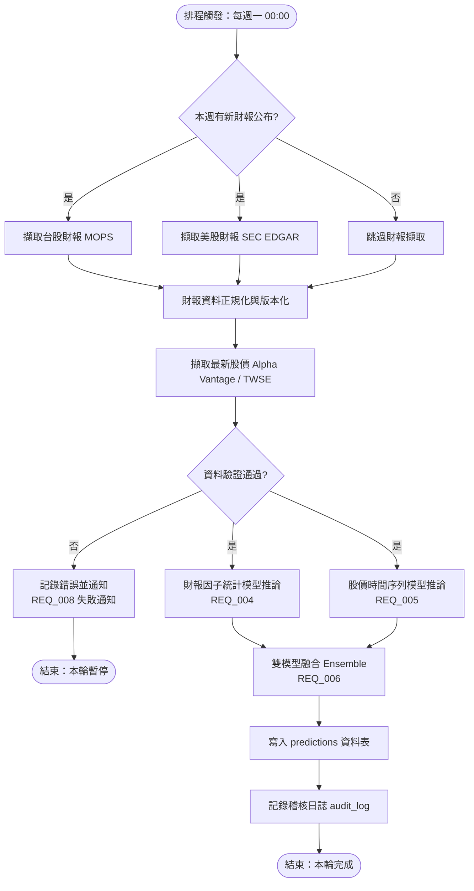
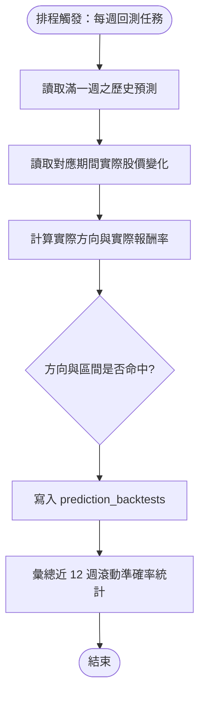

# 活動圖 (Activity Diagram)

> 生成日期：2026-07-14 | Phase 02 系統設計
> 說明：資料擷取 → 正規化 → 雙模型推論 → 融合 → 預測結果產出之完整流程

---

## 一、每週預測產出主流程

```mermaid
flowchart TD
    Start([排程觸發：每週一 00:00]) --> A{本週有新財報公布?}
    A -- 是 --> B1[擷取台股財報 MOPS]
    A -- 是 --> B2[擷取美股財報 SEC EDGAR]
    A -- 否 --> C[跳過財報擷取]
    B1 --> D[財報資料正規化與版本化]
    B2 --> D
    C --> D
    D --> E[擷取最新股價 Alpha Vantage / TWSE]
    E --> F{資料驗證通過?}
    F -- 否 --> G[記錄錯誤並通知<br/>REQ_008 失敗通知]
    G --> End1([結束：本輪暫停])
    F -- 是 --> H[財報因子統計模型推論<br/>REQ_004]
    F -- 是 --> I[股價時間序列模型推論<br/>REQ_005]
    H --> J[雙模型融合 Ensemble<br/>REQ_006]
    I --> J
    J --> K[寫入 predictions 資料表]
    K --> L[記錄稽核日誌 audit_log]
    L --> End2([結束：本輪完成])
```

## 二、預測準確率回測流程（REQ_009）

```mermaid
flowchart TD
    Start([排程觸發：每週回測任務]) --> A[讀取滿一週之歷史預測]
    A --> B[讀取對應期間實際股價變化]
    B --> C[計算實際方向與實際報酬率]
    C --> D{方向與區間是否命中?}
    D --> E[寫入 prediction_backtests]
    E --> F[彙總近 12 週滾動準確率統計]
    F --> End([結束])
```
