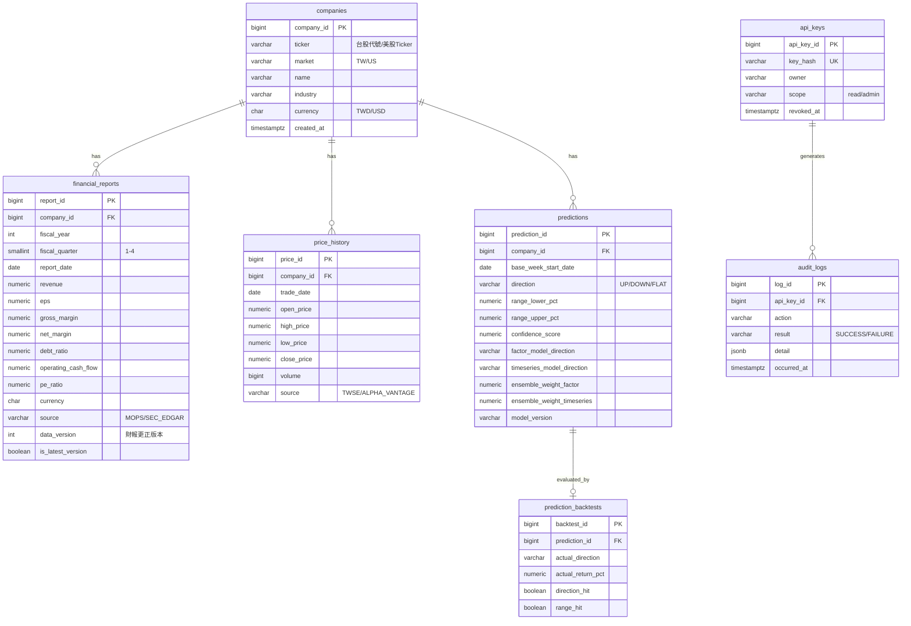

# ER 圖 (Entity Relationship Diagram)

> 生成日期：2026-07-14 | Phase 02 系統設計
> 來源：SSOT `specs/executable_spec.yaml` + `formal_requirements.md`
> 對應 DDL：`db_schema.sql`

---

## Mermaid 格式

---

## 設計說明

| 決策 | 理由 |
| :--- | :--- |
| `financial_reports` 以 `(company_id, fiscal_year, fiscal_quarter, data_version)` 唯一鍵 | 支援 REQ_003 財報更正版本追蹤，`is_latest_version` 供查詢時快速篩選最新版 |
| `predictions` 保留子模型明細欄位（`factor_model_*` / `timeseries_model_*`） | 對應 REQ_006 要求融合結果需保留兩子模型個別預測，供可解釋性追溯 |
| `api_keys` 僅存 `key_hash`，不存明文金鑰 | 對應資安需求 REQ_SEC_001 與構面 1（存取控制）最小揭露原則 |
| `audit_logs` 獨立於業務表 | 對應構面 2（事件日誌與可歸責性），Phase 03 實作時所有寫入/查詢動作皆應落一筆記錄 |
