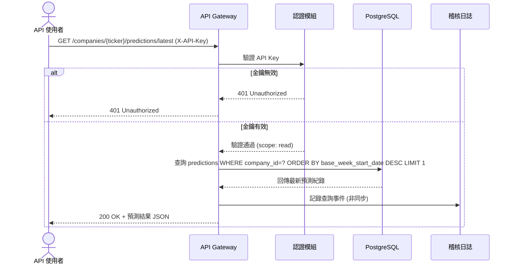
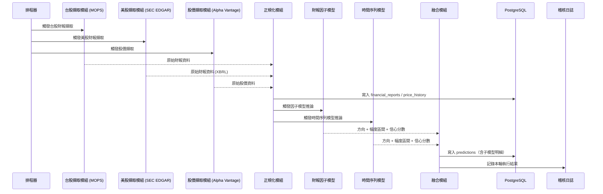

# 時序圖 (Sequence Diagram)

> 生成日期：2026-07-14 | Phase 02 系統設計

---

## 一、API 查詢最新預測結果

```mermaid
sequenceDiagram
    actor U as API 使用者
    participant API as API Gateway
    participant AUTH as 認證模組
    participant DB as PostgreSQL
    participant LOG as 稽核日誌

    U->>API: GET /companies/{ticker}/predictions/latest (X-API-Key)
    API->>AUTH: 驗證 API Key
    alt 金鑰無效
        AUTH-->>API: 401 Unauthorized
        API-->>U: 401 Unauthorized
    else 金鑰有效
        AUTH-->>API: 驗證通過 (scope: read)
        API->>DB: 查詢 predictions WHERE company_id=? ORDER BY base_week_start_date DESC LIMIT 1
        DB-->>API: 回傳最新預測紀錄
        API->>LOG: 記錄查詢事件 (非同步)
        API-->>U: 200 OK + 預測結果 JSON
    end
```

---

## 二、每週預測產出（排程觸發）

```mermaid
sequenceDiagram
    participant SCHED as 排程器
    participant ING_TW as 台股擷取模組 (MOPS)
    participant ING_US as 美股擷取模組 (SEC EDGAR)
    participant ING_PX as 股價擷取模組 (Alpha Vantage)
    participant NORM as 正規化模組
    participant FM as 財報因子模型
    participant TSM as 時間序列模型
    participant ENS as 融合模組
    participant DB as PostgreSQL
    participant LOG as 稽核日誌

    SCHED->>ING_TW: 觸發台股財報擷取
    SCHED->>ING_US: 觸發美股財報擷取
    SCHED->>ING_PX: 觸發股價擷取
    ING_TW-->>NORM: 原始財報資料
    ING_US-->>NORM: 原始財報資料 (XBRL)
    ING_PX-->>NORM: 原始股價資料
    NORM->>DB: 寫入 financial_reports / price_history
    NORM->>FM: 觸發因子模型推論
    NORM->>TSM: 觸發時間序列模型推論
    FM-->>ENS: 方向 + 幅度區間 + 信心分數
    TSM-->>ENS: 方向 + 幅度區間 + 信心分數
    ENS->>DB: 寫入 predictions（含子模型明細）
    ENS->>LOG: 記錄本輪執行結果
```

