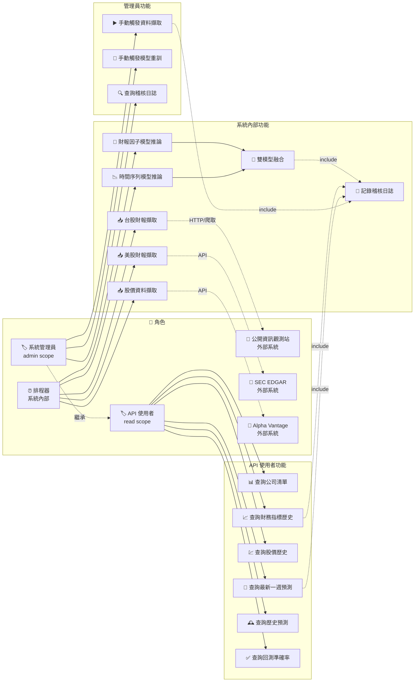

# 使用案例圖 (Use Case Diagram)

> 生成日期：2026-07-14 | Phase 02 系統設計
> 來源：SSOT `specs/executable_spec.yaml` + `formal_requirements.md`

---

## Mermaid 格式（角色 × 功能矩陣圖）



---

## 使用案例摘要

| 案例 | 參與者 | 說明 | 對應 REQ |
| :--- | :--- | :--- | :--- |
| UC-01 | API 使用者 | 查詢公司清單（可篩市場/產業） | REQ_003 |
| UC-02 | API 使用者 | 查詢財務指標歷史 | REQ_001/002/003 |
| UC-03 | API 使用者 | 查詢股價歷史 | REQ_005 |
| UC-04 | API 使用者 | 查詢最新一週預測結果 | REQ_004/005/006/007 |
| UC-05 | API 使用者 | 查詢歷史預測結果 | REQ_007 |
| UC-06 | API 使用者 | 查詢回測準確率報告 | REQ_009 |
| UC-07 | 系統管理員 | 手動觸發資料擷取任務 | REQ_008 |
| UC-08 | 系統管理員 | 手動觸發模型重訓 | REQ_008 |
| UC-09 | 系統管理員 | 查詢稽核日誌 | REQ_SEC_001（構面 2） |
| UC-10 | 排程器 | 台股財報擷取（MOPS） | REQ_001 |
| UC-11 | 排程器 | 美股財報擷取（SEC EDGAR） | REQ_002 |
| UC-12 | 排程器 | 股價資料擷取（Alpha Vantage） | REQ_002/005 |
| UC-13 | 排程器 | 財報因子模型推論 | REQ_004 |
| UC-14 | 排程器 | 時間序列模型推論 | REQ_005 |
| UC-15 | 排程器 | 雙模型融合 | REQ_006 |
| UC-16 | 系統 | 自動記錄所有查詢/擷取/推論行為至 audit_log | REQ_SEC_001 |

---

## 角色階層

```
API 使用者 (read)
  └─ 系統管理員 (admin) ← 繼承 read 權限 + 擴充排程觸發與稽核查詢
```
