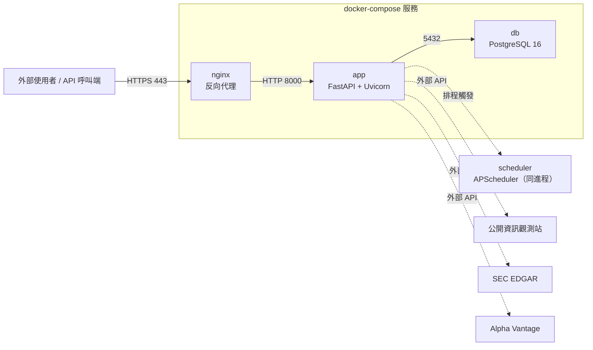

# 部署拓樸與依賴關係 (Deployment Topology)

> 生成日期：2026-07-14 | Phase 05 部署發布
> 部署方式：Docker（Dockerfile + docker-compose），本環境未安裝 Docker，故本階段**未實際 build/執行**，詳見「驗證限制」章節。
> 正式資料庫：PostgreSQL（取代開發/測試用之 SQLite）

## 一、服務拓樸圖

## 二、服務依賴順序（啟動順序）

1. **`db`（PostgreSQL）**：優先啟動，`healthcheck` 確認 `pg_isready` 通過後才允許下游服務啟動
2. **`app`（FastAPI）**：`depends_on: db (condition: service_healthy)`，啟動時執行 `init_db()`（建表，若未透過遷移腳本先行建立）
3. **`nginx`（反向代理）**：`depends_on: app`，最後啟動，對外唯一入口

## 三、回滾方案 (Rollback Plan)

| 情境 | 回滾步驟 |
| :--- | :--- |
| 新版本部署後 Health Check 失敗 | 1. `docker compose down`　2. `git checkout baseline-phase05-vN-1`（前一穩定 Baseline 標籤）　3. `docker compose up -d --build`　4. 重新執行 Smoke Test |
| 資料庫 Migration 失敗 | 1. 停止 `app` 服務　2. 從最近一次備份還原 PostgreSQL（見 `security_deployment_checklist.md` 備份章節）　3. 回退 `db_schema.sql` 至前一版本　4. 重啟服務 |
| 建置產物雜湊比對失敗（`build_manifest.json` 不符） | 1. 中止部署，不覆蓋現行運行版本　2. 回報並重新建置　3. 重新計算並比對雜湊後才允許部署 |

**回滾判斷依據**：Baseline 標籤（`baseline-phaseNN-vN`，本專案已累積 `baseline-phase01-v1`~`baseline-phase04-v1`）與 Git commit history 皆可作為回滾錨點。

## 四、驗證限制（誠實揭露）

> ⚠️ 本機開發環境**仍未安裝 Docker、nginx**，故 Dockerfile / docker-compose.yml / nginx.conf 仍為**依標準實踐撰寫，但未經實際 `docker build` / `docker compose up` / `nginx -t` 驗證**。**PostgreSQL 部分已於 2026-07-15 補做真實驗證（見下）**，不再屬於本節限制範圍。

**已完成的驗證（不需 Docker 即可執行）**：
- FastAPI 應用本身：已於 Phase 03/04 以真實 `uvicorn` 進程 + 真實 HTTP 驗證可運作（`04_testing/outputs/test_api.py`）
- `db_schema.sql`：PostgreSQL DDL 語法（Phase 02 產出），本階段新增之 `audit_logs.source_ip` 欄位已納入
- `requirements.txt` 套件版本：已於 Phase 03/04 於本機環境實際安裝並通過全部測試
- **PostgreSQL 連線字串與實際資料表建立（2026-07-15 補驗證）**：使用者提供真實 Supabase PostgreSQL（`postgresql+psycopg://...@aws-0-ap-southeast-2.pooler.supabase.com:5432/postgres`），實際執行 `db_schema.sql` 建立全部 7 張資料表（`companies`、`financial_reports`、`price_history`、`predictions`、`prediction_backtests`、`api_keys`、`audit_logs`），並以真實 MOPS/TWSE/SEC EDGAR/Alpha Vantage 資料完成寫入與 API 讀取驗證（詳見 `memory.md`）。`JSONB`（`audit_logs.detail`）與 `TIMESTAMPTZ` 等 Postgres 專屬型別皆運作正常，與本機 SQLite 測試環境行為一致。
- FastAPI 應用以真實 `uvicorn` 進程連接此 Supabase 資料庫，`/health` 與 `/api/v1/companies/*` 端點皆以真實請求驗證通過（非容器化，`app` 服務單獨啟動）。

**待實際部署環境驗證項目（僅剩 Docker/nginx 相關）**：
- `docker build` 是否成功產出映像檔
- `docker compose up` 服務啟動順序與健康檢查是否如預期運作（`app`→`db` 依賴、`nginx`→`app` 依賴）
- `nginx.conf` 語法（`nginx -t`）與反向代理實際轉發行為

**建議**：正式部署前，於具備 Docker 之環境執行 `docker compose config` 驗證組態語法，並執行 `docker compose up` 後對 `/health` 端點做煙霧測試（資料庫改連接容器內 `db` 服務或維持外部 Supabase 皆可）。
